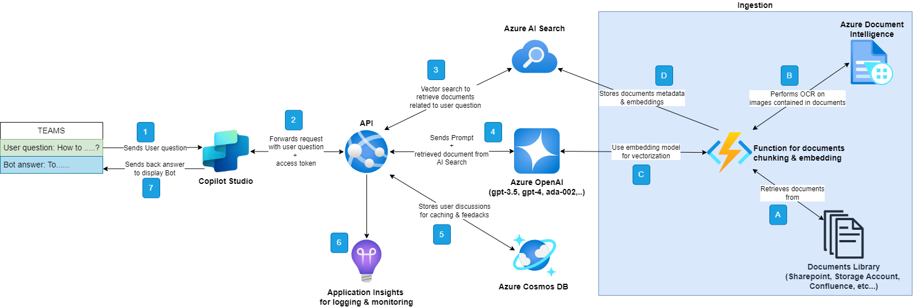

# RAG from Zero to Hero

Welcome to the RAG from Zero to Hero project!

This project aims to provide a comprehensive guide to become proficient in RAG (Retrieval Augmented Geneation) system.

In this guide, you will find step-by-step instructions, examples, and best practices for using RAG in Azure.

RAG is a powerful model that combines retrieval and generation capabilities to generate high-quality responses to user queries based on `your own data`. Here is the architecture of the RAG components that will be built in this guide:


This diagram illustrates the workflow of a RAG system using Azure AI Services and Azure OpenAI models. The process starts with a user question and ends with providing an answer, going through various processing and integration stages. Here is a step-by-step explanation of the process:

0. **Teams**: The conversation starts in Teams, where a user asks a question. The bot then sends the question to Copilot Studio.

2. **Copilot Studio**: It takes the user's question and transmits it via an API with an access token for authentication.

3. **API**: The request is sent to an API service that uses vector search to find relevant documents related to the user's question.

4. **Azure AI Search**: This sends the request to Azure AI Search, which performs a vector search to find the most relevant documents from a database of documents.

5. **Azure OpenAI**: An OpenAI model (such as GPT-3.5, GPT-4, ada-002, etc.) receives the retrieved documents and the user's question, then generates a response based on the information contained in those documents.

6. **Azure Cosmos DB**: An Azure database that stores user conversations for caching and feedback collection to improve the response system.

7. **Application Insights**: A monitoring and logging service to analyze the application's operation and optimize the user experience.

8. **Response**: The generated response is sent back to the user in Teams, completing the conversation cycle.

The diagram also shows a document ingestion process on the right side, indicating how documents are processed and stored in AI Search:

A. **Documents Library**: A library of documents that can include various sources such as SharePoint, storage accounts, Confluence, Web Pages, etc.

B. **Azure Document Intelligence**: A function that performs Optical Character Recognition (OCR) on images contained in the documents to convert the text into digital data.

C. **Function for documents chunking & embedding**: A function that processes documents by breaking them into smaller sections and using an embedding model for vectorization, making them ready for vector search.

D. **Azure AI Search**: This part stores the metadata of the documents and the embeddings, making them easier to retrieve during search.

The diagram depicts a complex workflow where each component has a specific role in facilitating information retrieval and generating accurate responses to user questions. It illustrates a deep integration of Azure services to build an interactive AI-based system that can be used directly from a messaging application such as Teams.

## Installation

- Install VS Code with the following extensions:
  - [Polyglot Notebooks](https://marketplace.visualstudio.com/items?itemName=ms-dotnettools.dotnet-interactive-vscode)
  - [C# Dev Kit](https://marketplace.visualstudio.com/items?itemName=ms-dotnettools.csdevkit)
  - [Bicep](https://marketplace.visualstudio.com/items?itemName=ms-azuretools.vscode-bicep)
  - [draw.io](https://marketplace.visualstudio.com/items?itemName=hediet.vscode-drawio) to display & modify the architecture diagrams
- Install [az cli](https://learn.microsoft.com/en-us/azure/azure-resource-manager/bicep/install#azure-cli)
- Install [.NET 8.0 SDK](https://dotnet.microsoft.com/en-us/download/dotnet/8.0)

## Repository Structure
- `.azdo/`: Contains CI/CD pipelines for Azure DevOps.
- `data/`: Data folders including PDFs such as benefit options, the employee handbook, and others.
- `docs/`: Folders for documentation and associated architecture diagrams and images, including the system architecture.
- `infra/`: Contains Bicep scripts for Azure infrastructure. It leverages [Azure Verified Modules](https://azure.github.io/Azure-Verified-Modules/) to ease modules development.
- `notebooks/`: Jupyter Notebooks.
- `src/`: Contains the project's source code in C# of the API and Function App.


## Usage

You should deploy the Azure resources. The resources are defined in the `infra` folder using Bicep. Resources will be added as needed in the guide.

First, create an Azure Resource Group using az cli:
```bash	
az group create --name myResourceGroup --location francecentral
```

Go to `infra` folder and fill the [main.bicepparam](infra/main.bicepparam) file with the necessary parameters. Then, deploy the [main.bicep](infra/main.bicep) file to create the necessary resources:
```bash
az deployment group create --resource-group <myResourceGroup> --template-file main.bicep --parameters main.bicepparam
```

## Guide
1. [Getting Started](notebooks/0-getting-started.ipynb)
2. [OCR to the Rescue](docs/OCR-to-the-rescue_en.md)


