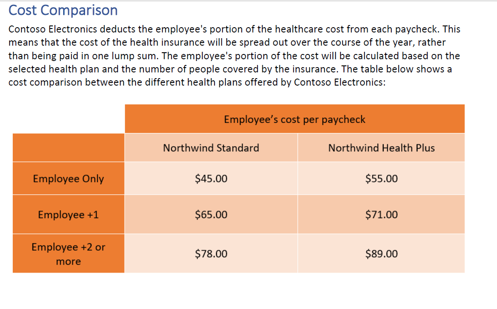
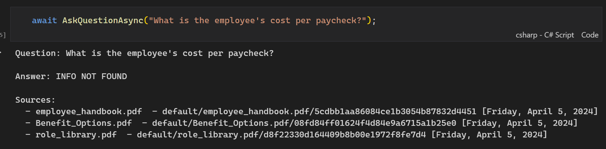
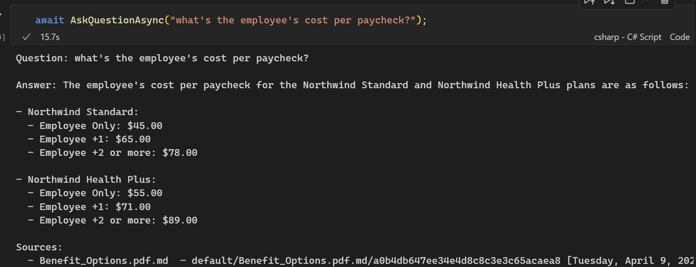

Improving RAG with Azure Document Intelligence and Markdown format
====================================================================================================

Introduction
------------

In the [previous section](../notebooks/0-getting-started.ipynb), we noticed a major limitation when implementing RAG by directly splitting the PDF: tables are not taken into account (see screenshots below). Consequently, the model cannot answer questions related to them.




1. Solution: Azure Document Intelligence
----------------------------------------

To solve this problem, we introduced [Azure Document Intelligence](https://learn.microsoft.com/en-us/azure/ai-services/document-intelligence/overview?view=doc-intel-4.0.0), an artificial intelligence service that performs OCR on PDF documents and extracts the content as structured text. This service not only extracts tables but also preserves the structure and semantics of the original document.

The IaC has been updated to include the Azure Document Intelligence resource:
- new module: [document-intelligence.bicep](../infra/core/ai/doc-intelligence.bicep)
- update of [main.bicep](../infra/main.bicep) to include the module.

2. Conversion to Markdown format
-------------------------------

Azure Document Intelligence converts the content of PDFs to Markdown format, a language that allows text structuring and adding semantics. This conversion offers several advantages:

a. Table consideration: Tables are correctly extracted and converted to Markdown format, enabling the RAG model to process and respond to them.

b. Improved semantics: The Markdown structure provides additional semantics to the language model (LLM), thus facilitating context understanding and improving the relevance of responses.

c. Compatibility: The Markdown format is widely supported by text processing tools and platforms, making it easy to integrate into natural language processing pipelines.

Azure Document Intelligence has an online studio that allows visualizing and converting the content of PDF documents to Markdown. It's very convenient for visualizing the OCR result and checking the conversion quality.


3. Integrating Markdown into RAG
--------------------------------------

To integrate Markdown into RAG, we adapted the document indexing pipeline. First, we perform OCR on PDF documents with Azure Document Intelligence to obtain the content in Markdown. Then, we index this content in the vector database to allow the RAG model to retrieve it and generate responses.

The complete code for integrating Markdown into RAG is available in the file [1-getting-started-with-ocr.ipynb](../notebooks/1-getting-started-with-ocr.ipynb).

Here is the part of the C# code that illustrates this integration:
- Initializing the Azure Document Intelligence client
```csharp
var docIntelEndpoint =  env["AZURE_DOCUMENT_INTELLIGENCE_ENDPOINT"];
var credential = new DefaultAzureCredential();
var docIntelClient = new DocumentIntelligenceClient(new Uri(docIntelEndpoint), credential);
```
- Converting the content of PDF documents to Markdown
```csharp
string folderPath = "../data";
string[] pdfFiles = Directory.GetFiles(folderPath, "*.pdf", SearchOption.AllDirectories);

foreach (var pdfFile in pdfFiles)
{
    var markdownFilePath = $"{pdfFile}.md";
    if (File.Exists(markdownFilePath))
    {
        Console.WriteLine($"Skipping {pdfFile} because it already has a markdown file");
        return;
    }

    try
    {
        using var fileStream = File.OpenRead(pdfFile);
        var binaryData = BinaryData.FromStream(fileStream);
        var analyzeRequest = new AnalyzeDocumentContent
        {
            Base64Source = binaryData
        };
        var result = await docIntelClient.AnalyzeDocumentAsync(waitUntil: WaitUntil.Completed, "prebuilt-layout", analyzeRequest: analyzeRequest, outputContentFormat: ContentFormat.Markdown);
        var markdownContent = result.Value.Content;
        await File.WriteAllTextAsync(markdownFilePath, markdownContent);
        Console.WriteLine($"Created: {markdownFilePath}");
    }
    catch (Exception ex)
    {
        Console.WriteLine($"Error during OCR processing of {pdfFile}: {ex.Message}");
    }
}
```
- Indexing Markdown content in the vector database
```csharp
string[] markdownFiles = Directory.GetFiles(folderPath, "*.md", SearchOption.AllDirectories);
foreach (string filePath in markdownFiles)
{
    string fileName = Path.GetFileName(filePath);
    string fullPath = Path.GetFullPath(filePath);

    await memory.ImportDocumentAsync(fullPath, documentId: fileName);

    Console.WriteLine("Successfully imported File Name: " + fileName);
}
```

4. Results and Conclusions
---------------------------

After integrating Azure Document Intelligence and the Markdown format into the RAG pipeline, we noticed a significant improvement in the model's performance. Tables are correctly taken into account, and the model can answer questions related to them.



In summary, integrating Azure Document Intelligence and using the Markdown format have improved RAG's performance by considering tables and providing additional semantics to the language model. This approach has proven its effectiveness, and we will apply it in the rest of this project.